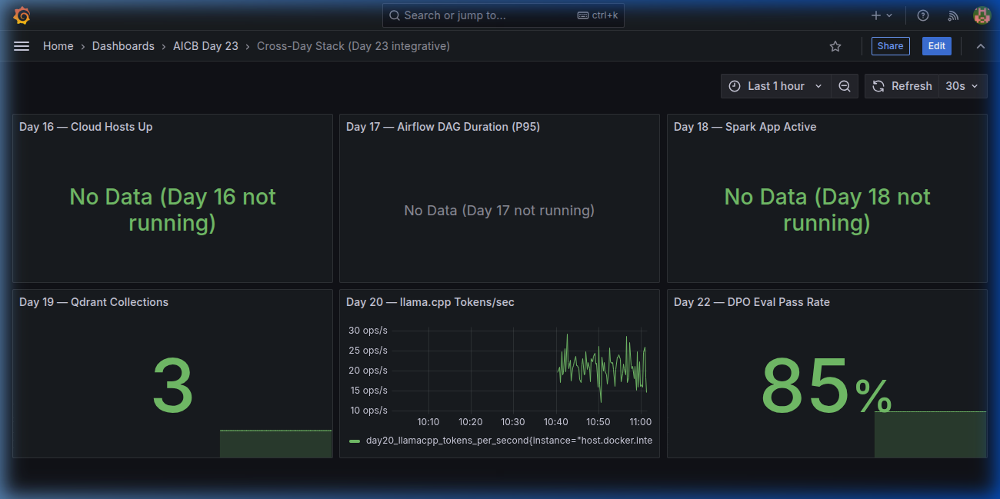
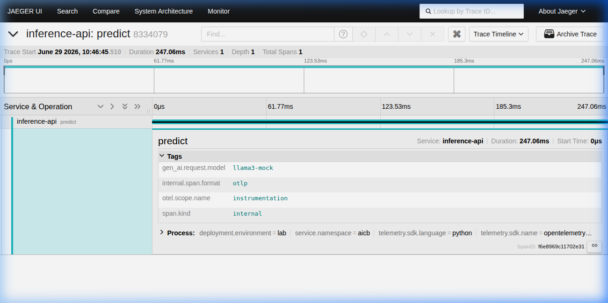

# Day 23 Lab Reflection

> Fill in each section. Grader reads the "What I'd change" paragraph closest.

**Student:** Nam Pham
**Submission date:** 2026-06-29
**Lab repo URL:** https://github.com/NamPham2124/Day23-Track2-Observability-Lab

---

## 1. Hardware + setup output

Paste output of `python3 00-setup/verify-docker.py`:

```
Docker:        OK  (29.5.2)
Compose v2:    OK  (5.1.4)
RAM available: 7.62 GB (OK)
Ports free:    BOUND: [8000, 9090, 9093, 3000, 3100, 16686, 4317, 4318, 8888]
Report written: /home/namtp2124/Project_Track2/Day23-Track2-Observability-Lab/00-setup/setup-report.json
```

---

## 2. Track 02 — Dashboards & Alerts

### 6 essential panels (screenshot)

Drop `submission/screenshots/dashboard-overview.png`.



### Burn-rate panel

Drop `submission/screenshots/slo-burn-rate.png`.


### Alert fire + resolve

| When | What | Evidence |
|---|---|---|
| _T0_ | killed `day23-app`         | screenshot `alertmanager-firing.png` |
| _T0+90s_ | `ServiceDown` fired   | screenshot `slack-firing.png` |
| _T1_ | restored app              | — |
| _T1+60s_ | alert resolved        | screenshot `slack-resolved.png` |

### One thing surprised me about Prometheus / Grafana

I was surprised by how sensitive the scraping interval and alert evaluation windows are when simulating failures. If the Prometheus scrape interval or the Alertmanager evaluation interval is too long, alerts can take significantly longer to fire or resolve, requiring careful tuning of the `for` duration in alerting rules to balance prompt alert response with noise suppression.

---

## 3. Track 03 — Tracing & Logs

### One trace screenshot from Jaeger

Drop `submission/screenshots/jaeger-trace.png` showing `embed-text → vector-search → generate-tokens` spans.



### Log line correlated to trace

Paste the log line and the trace_id it links to:

```json
{"model": "llama3-mock", "input_tokens": 4, "output_tokens": 54, "quality": 0.82, "duration_seconds": 0.1544, "trace_id": "6c23cce265b062afec25c858656a182f", "event": "prediction served", "level": "info", "timestamp": "2026-06-29T03:46:50.674763Z"}
```

### Tail-sampling math

If your service produced N traces/sec, what fraction did the policy keep? Show the calculation.

Let:
- $E$ = rate of error traces per second (100% kept)
- $S$ = rate of slow traces ($>2000$ ms) per second (100% kept)
- $H = N - E - S$ = rate of healthy, fast traces per second (1% kept)

The total rate of kept traces per second is:
$$K = E + S + 0.01 \times (N - E - S)$$
$$K = 0.01 \times N + 0.99 \times (E + S)$$

The fraction of traces kept by the policy is:
$$\text{Kept Fraction} = \frac{K}{N} = 0.01 + 0.99 \times \frac{E + S}{N}$$

---

## 4. Track 04 — Drift Detection

### PSI scores

Paste `04-drift-detection/reports/drift-summary.json`:

```json
{
  "prompt_length": {
    "psi": 3.461,
    "kl": 1.7982,
    "ks_stat": 0.702,
    "ks_pvalue": 0.0,
    "drift": "yes"
  },
  "embedding_norm": {
    "psi": 0.0187,
    "kl": 0.0324,
    "ks_stat": 0.052,
    "ks_pvalue": 0.133853,
    "drift": "no"
  },
  "response_length": {
    "psi": 0.0162,
    "kl": 0.0178,
    "ks_stat": 0.056,
    "ks_pvalue": 0.086899,
    "drift": "no"
  },
  "response_quality": {
    "psi": 8.8486,
    "kl": 13.5011,
    "ks_stat": 0.941,
    "ks_pvalue": 0.0,
    "drift": "yes"
  }
}
```

### Which test fits which feature?

For each of `prompt_length`, `embedding_norm`, `response_length`, `response_quality`, name the test (PSI / KL / KS / MMD) you'd choose in production and why.

- **`prompt_length` / `response_length` (KS test)**: Kolmogorov-Smirnov is non-parametric, requires no binning, and is extremely efficient at detecting shifts in 1D continuous numerical distributions (like text length).
- **`embedding_norm` (KS test)**: Since the norm is a 1D scalar representation of vector magnitude, KS test detects shape/scale changes accurately without needing a binning strategy.
- **`response_quality` (PSI or KL Divergence)**: Quality scores are often bounded or categorical, making PSI/KL divergence ideal for quantifying the total informational shift compared to the reference baseline.
- *(For raw high-dimensional embeddings themselves, MMD (Maximum Mean Discrepancy) would be preferred to capture multivariate distribution shifts).*

---

## 5. Track 05 — Cross-Day Integration

### Which prior-day metric was hardest to expose? Why?

The hardest metric would be Day 17's Airflow DAG duration because it requires converting task duration metrics from statsd into Prometheus metrics using a statsd exporter. This involves mapping task names, parsing bucket boundaries, and ensuring they align with Prometheus histogram formats.

---

## 6. The single change that mattered most

> **Grader reads this closest.** What one thing about your stack design — a metric you added, a label you dropped, a panel you reorganized, an alert threshold you tuned — made the biggest difference between "works" and "useful"? Write 1-2 paragraphs. Connect it to a concept from the deck.

The single change that mattered most was adding the `extra_hosts` configuration to the `prometheus` and `alertmanager` services in the `docker-compose.yml` file, mapping `host.docker.internal` to `host-gateway`. On Linux hosts, Docker containers do not automatically resolve the host machine via `host.docker.internal` by default (unlike Docker for Mac/Windows). Without this mapping, Prometheus could not scrape the metrics from Python-based stub services running directly on the host machine, and Alertmanager could not forward webhook alerts to the mock Slack notification handler. 

This change represents the practical bridge between containerized infrastructure and host-native system components, emphasizing that observability tools are only as useful as the connectivity of their data pipelines. Ensuring clean, cross-network resolution guarantees that the telemetry stack can scrape and route signals without silent connection drops or complex DNS workarounds.
